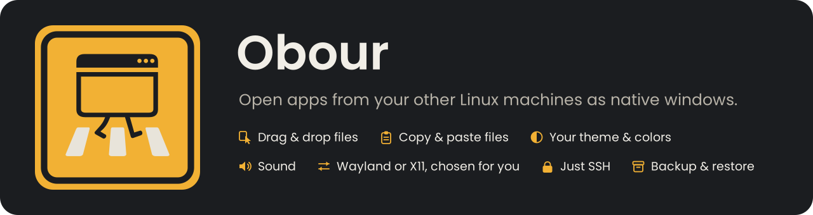
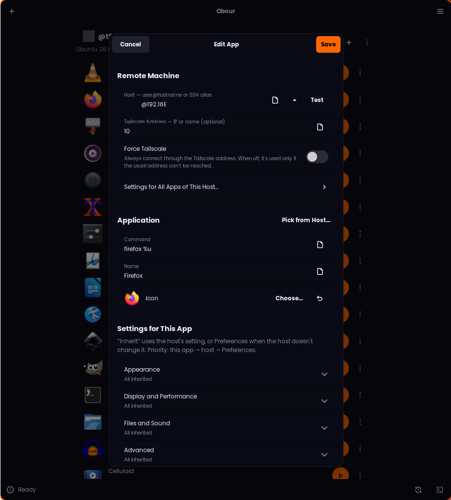

<p align="center">
  
</p>

<p align="center">
  <a href="https://github.com/Jazzmedo/Obour/releases/latest"></a>
  <a href="LICENSE"></a>
  
  
</p>

> [!WARNING]
> **Obour is in alpha.** Tested only with **Ubuntu Server 26.04** as the remote computer and
> **Hyprland** as the desktop, so expect bugs elsewhere.
>
> **We need your testing and contributions to fix the app.**
> [Open an issue](https://github.com/Jazzmedo/Obour/issues/new/choose) with your setup and the
> log, or send a pull request (see [CONTRIBUTING.md](CONTRIBUTING.md)).

**Obour** (means crossing in Arabic) opens apps from another Linux computer as normal windows on
your desktop, with their sound on your speakers. Pick an app, press play, done.

**Website:** [jazzmedo.github.io/Obour](https://jazzmedo.github.io/Obour/)

<p align="center">
  
  
</p>

## Features

- **Wayland and X11 apps**: Wayland through `waypipe`, X11 through SSH. Obour picks one per app and remembers it.
- **Sound with zero setup**: PipeWire or PulseAudio forwarded over the same SSH connection (PulseAudio, PipeWire and ALSA apps).
- **App browser**: see a computer's installed apps with their icons and add them in one click.
- **Looks like your desktop**: your colors, icons, fonts and cursor in GTK, Qt and KDE apps.
- **Drag, copy and paste files** between the two computers, both ways.
- **Host setup**: finds missing tools and installs them with `apt`, `dnf` or `pacman` when you agree.
- **Smart fallbacks**: if a Wayland app fails, Obour retries without GPU sharing, then with X11.
- **Closes cleanly**: closing a window also ends what the app left running on the host.
- **Easy logins**: SSH key first; after one password it can set up key login for you.
- **Tailscale**: a second address per computer, for when the usual one is unreachable.
- **App menu**: add any app to your system menu from its ⋮ menu.
- **Backup and restore**: everything in one `.zip`, app-menu entries included.
- **English and Arabic** (right-to-left).

## Install

<details open>
<summary><b>AppImage</b> (any distribution; updates through Gear Lever)</summary>

Download `Obour-<version>-x86_64.AppImage` from the [latest release](https://github.com/Jazzmedo/Obour/releases/latest), then either:

- open it with [Gear Lever](https://flathub.org/apps/it.mijorus.gearlever), which adds it to your app menu and keeps it updated from this repository, or
- run it directly:

  ```sh
  chmod +x Obour-*-x86_64.AppImage
  ./Obour-*-x86_64.AppImage
  ```

It bundles Python, GTK 4 and libadwaita; you only need `openssh-client` and `waypipe`.
Runs on Ubuntu 24.04+, Debian 13+, Fedora 40+, Arch and similar.
</details>

<details>
<summary><b>Debian / Ubuntu</b> (.deb)</summary>

```sh
sudo apt install ./obour_<version>_all.deb
```

Needs Debian 13+ or Ubuntu 24.04+.
</details>

<details>
<summary><b>Fedora / openSUSE</b> (.rpm)</summary>

```sh
sudo dnf install ./obour-<version>-1.noarch.rpm
```
</details>

<details>
<summary><b>NixOS / Nix</b> (flake)</summary>

Try it without installing:

```sh
nix run github:Jazzmedo/Obour
```

On NixOS, in `/etc/nixos/flake.nix`:

```nix
{
  inputs.obour.url = "github:Jazzmedo/Obour";

  outputs = { nixpkgs, obour, ... }: {
    nixosConfigurations.my-pc = nixpkgs.lib.nixosSystem {
      modules = [ ./configuration.nix obour.nixosModules.default ];
    };
  };
}
```

Home Manager: `home.packages = [ inputs.obour.packages.${pkgs.system}.default ];`.
Update with `nix flake update obour`.
</details>

<details>
<summary><b>From source</b></summary>

**Prerequisites**

| Requirement | Version | Ubuntu / Debian | Fedora | Arch |
|---|---|---|---|---|
| Python | 3.11+ | `python3` | `python3` | `python` |
| PyGObject | | `python3-gi` | `python3-gobject` | `python-gobject` |
| GTK | 4 | `gir1.2-gtk-4.0` | `gtk4` | `gtk4` |
| libadwaita | 1.5+ | `gir1.2-adw-1` | `libadwaita` | `libadwaita` |
| OpenSSH client | | `openssh-client` | `openssh-clients` | `openssh` |
| waypipe (Wayland apps) | | `waypipe` | `waypipe` | `waypipe` |
| sshfs (pasting files from the host) | | `sshfs` | `fuse-sshfs` | `sshfs` |

```sh
git clone https://github.com/Jazzmedo/Obour.git && cd Obour
./install.sh               # or run it in place: bin/obour
./install.sh --uninstall
```
</details>

## The remote computer

It needs an SSH server (with `X11Forwarding yes` for X11 apps). Obour offers to install the rest:

| Needed for | Ubuntu / Debian | Fedora | Arch |
|---|---|---|---|
| Wayland apps | `waypipe` | `waypipe` | `waypipe` |
| X11 apps | `xauth` | `xorg-x11-xauth` | `xorg-xauth` |
| Sound | `libpulse0` | `pulseaudio-libs` | `libpulse` |
| Sound from apps that use ALSA directly | `libasound2-plugins` | `alsa-plugins-pulseaudio` | `alsa-plugins` |
| Separate app instances | `dbus` | `dbus-daemon` | `dbus` |
| The app browser | `python3` | `python3` | `python` |
| Dark mode for Qt 5 apps | `adwaita-qt` | `kvantum-qt5` | `kvantum-qt5` |
| Light/dark for Qt 6 apps | `qt6-gtk-platformtheme` | `qt6-qtbase-gui` | `qt6-base` |
| Copy and paste files | `sshfs` | `fuse-sshfs` | `sshfs` |

Qt apps also need your desktop's Qt settings package: `qt6ct`/`qt5ct` (Hyprland, niri, sway…),
`plasma-integration` (KDE Plasma) or `lxqt-qtplugin` (LXQt).

## Copying files between computers

Copy a file in one computer's app and paste it in the other's, or drag it across (for example
from Dolphin into a remote mpv). Differences from a local copy:

- Files move at network speed.
- **Cut** doesn't move files between computers; use **Copy**.
- Pasting a file into a text field gives a long path (`/tmp/obour-…/file.txt`).
- While sharing is on, the host can read the files you copied (read-only), nothing else.

*Copy, Paste and Drag Files* can be *Always Allow*, *Ask Every Time* or *Deny*. This computer
needs `sshfs` to paste files copied on the host.

## Settings for each host and app

Any setting in Preferences can be changed for one host (⋮ → *Host Settings…*) or one app
(*Edit…*). Each row starts at **Inherit**. The priority is:

**this app → its host → Preferences**

## Using it

1. Press **+** → *Add Apps from a Computer…* and enter `user@host` (or an alias from `~/.ssh/config`).
2. Add the apps you want. Obour checks the computer and offers to install anything missing.
3. Press ▶ next to an app. Press ■ to close it, both here and on the remote computer.

| Shortcut | Action |
|---|---|
| <kbd>Ctrl</kbd>+<kbd>N</kbd> | Add apps from a computer |
| <kbd>Ctrl</kbd>+<kbd>Shift</kbd>+<kbd>N</kbd> | Add an app by its command |
| <kbd>Ctrl</kbd>+<kbd>,</kbd> | Preferences (style, compression, language…) |
| <kbd>Ctrl</kbd>+<kbd>L</kbd> | Show or hide the log |

From a terminal: `obour list` and `obour launch <id>`.

### Backup and restore

Main menu → *Back Up…* saves your apps, app-menu entries, hosts, settings, icons and SSH
`known_hosts` to one `.zip`, optionally with your SSH key (then keep the file private).
Passwords are never saved.

Main menu → *Restore From a Backup…* puts it all back. Your current setup is saved first, and an
existing SSH key is never replaced.

From a terminal: `obour backup obour.zip [--with-ssh-key]` and `obour restore obour.zip`.

## Troubleshooting

- **Wayland or X11?** Leave Display on *Inherit*. Obour tries Wayland and switches to X11 if the app fails, then remembers it (*Edit… → Try Wayland Again* undoes it).
- **No window appears**: the log (<kbd>Ctrl</kbd>+<kbd>L</kbd>) says why.
- **Wayland apps never open and the host has `waypipe` stuck in state `D`**: its graphics driver froze. Keep *GPU Acceleration* off and reboot the host.
- **Asked for a password although your key is there**: the login dialog says why. Often the user is wrong (`user@host`) or `~/.ssh` on the host is writable by others.
- **"The host refused X11 forwarding"**: set `X11Forwarding yes` in `/etc/ssh/sshd_config` and install `xauth` on the host.
- **Firefox says "closed unexpectedly"**: click **Open**; it won't repeat.
- **Apps don't look like your desktop, or a Qt app stays light**: ⋮ → *Set Up Host…* lists what's missing. *Use My Desktop Theme* must be on.
- **Pasted or dropped files aren't found**: allow *Copy, Paste and Drag Files* for the app and check that the host has `sshfs` (⋮ → *Set Up Host…*).

More in [docs/HOW-IT-WORKS.md](docs/HOW-IT-WORKS.md).

## Contributing

Bug reports, translations and fixes are welcome; see [CONTRIBUTING.md](CONTRIBUTING.md).

## License

[MIT](LICENSE) © 7anafi
